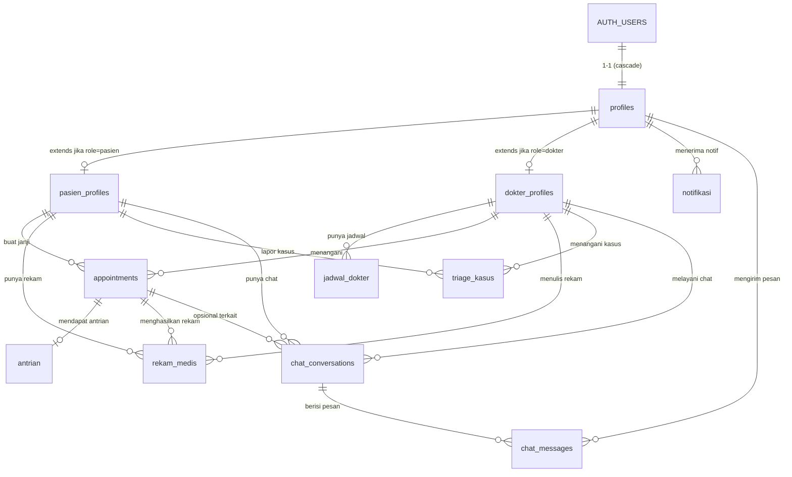

# Database — Supabase Schema

Skema database Klinik Gigi untuk Supabase (Postgres). Berisi:

- Migration files (DDL + RLS) di `migrations/`
- Seed data dev di `seed_dev.sql`

---

## 1. Struktur file

```
supabase/
├── migrations/
│   ├── 0001_initial_schema.sql                ← extensions, ENUMs, tables, indexes, triggers
│   ├── 0002_rls_policies.sql                  ← Row Level Security untuk tabel inti
│   ├── 0003_fix_rls_and_harden_trigger.sql    ← bug fix: dokter SELECT pasien, harden trigger
│   ├── 0004_appointments_unique_slot.sql      ← cegah double-booking dokter per slot aktif
│   ├── 0005_enable_notifikasi_realtime.sql    ← realtime untuk notifikasi
│   ├── 0006_chat_realtime_schema.sql          ← tabel chat_conversations + chat_messages
│   ├── 0007_fix_pasien_profiles_rls.sql       ← policy tambahan pasien/chat
│   └── 0008_sync_runtime_policies_and_chat_timestamp.sql ← sinkronisasi policy + trigger chat
├── seed_dev.sql                  ← sample data dev (commented by default)
└── README.md                     ← file ini
```

---

## 2. Cara apply (paling cepat: SQL Editor)

1. Buka [Supabase Dashboard](https://supabase.com/dashboard) → project Anda.
2. Sidebar → **SQL Editor** → **+ New query**.
3. Jalankan semua file di `migrations/` secara berurutan dari `0001` sampai `0008`.
4. Verifikasi: sidebar → **Table Editor**, harus muncul 11 tabel di schema `public`.

> Migration **idempotent** — aman dijalankan ulang kalau ada step yang gagal.

> Project lama yang sudah apply 0001 + 0002 cukup jalankan 0003 saja untuk
> mendapat fix RLS dokter & trigger yang lebih tahan banting.

### Alternatif: Supabase CLI

```bash
# install CLI sekali
npm i -g supabase

# di folder backend-klinik-sofeng/
supabase link --project-ref <YOUR-PROJECT-REF>
supabase db push
```

CLI akan auto-detect file di `supabase/migrations/` dan apply berurutan.

---

## 3. ERD



---

## 4. Daftar tabel & kolom kunci

### `profiles` — extends `auth.users`
| Kolom | Tipe | Keterangan |
|---|---|---|
| `id` | uuid PK | = `auth.users.id` |
| `full_name` | text | dari user_metadata.full_name |
| `role` | enum `user_role` | `'pasien'` \| `'dokter'` |
| `email`, `phone`, `avatar_url` | text | |

> Auto-created via trigger `on_auth_user_created` saat sign-up.

### `pasien_profiles` — `id` references `profiles(id)`
- `no_rm` (unik), `tanggal_lahir`, `jenis_kelamin` ('L'/'P')
- `alamat`, `golongan_darah`, `riwayat_alergi`, `catatan_medis`

### `dokter_profiles` — `id` references `profiles(id)`
- `nip` (unik), `sip`, `spesialisasi`
- `rating` (0–5), `bio`, `pengalaman_tahun`

### `jadwal_dokter` — slot kerja per hari (recurring)
- `dokter_id`, `hari` (0=Min..6=Sab), `jam_mulai`, `jam_selesai`, `kuota`, `is_active`

### `appointments` — janji temu
- `pasien_id`, `dokter_id`, `tanggal`, `jam`
- `jenis` enum (konsultasi, pemeriksaan, kontrol, tindakan, darurat)
- `status` enum (terjadwal, menunggu, sedang_ditangani, selesai, dibatalkan, tidak_hadir)
- `keluhan`, `catatan_dokter`

### `rekam_medis` — catatan medis pasca pemeriksaan
- `pasien_id`, `dokter_id`, `appointment_id` (nullable)
- `tanggal`, `diagnosa` (NOT NULL), `tindakan`, `resep`, `biaya`

### `triage_kasus` — kasus darurat
- `pasien_id`, `dokter_id` (nullable, di-assign saat ditangani)
- `level` enum (hijau, kuning, merah)
- `status` enum (terbuka, sedang_ditangani, selesai)
- `gejala`, `catatan_penanganan`

### `antrian` — queue real-time
- `appointment_id` (unik), `nomor`, `status`, `estimasi_jam`
- `dipanggil_at`, `selesai_at`

### `notifikasi`
- `user_id` references `profiles(id)`
- `type` enum (pengingat, konfirmasi, pengumuman, darurat, lainnya)
- `title`, `description`, `link`, `read_at`

### `chat_conversations`
- `pasien_id`, `dokter_id`, `appointment_id` (nullable)
- `subject`, `status` (`aktif`/`ditutup`), `last_message_at`

### `chat_messages`
- `conversation_id`, `sender_id`
- `body`, `read_at`, `created_at`

---

## 5. Pola RLS (Row Level Security)

| Tabel | Pasien | Dokter | Public |
|---|---|---|---|
| `profiles` | SELECT/UPDATE diri sendiri | SELECT semua user (after 0003) | — |
| `pasien_profiles` | SELECT/INSERT/UPDATE diri | SELECT/UPDATE semua pasien | — |
| `dokter_profiles` | SELECT semua | SELECT/INSERT/UPDATE diri sendiri | — |
| `jadwal_dokter` | SELECT semua | manage jadwal sendiri | — |
| `appointments` | SELECT/INSERT/DELETE (terjadwal) miliknya | SELECT/UPDATE yang ditangani | — |
| `rekam_medis` | SELECT miliknya (read-only) | full manage yang dia tulis | — |
| `triage_kasus` | SELECT/INSERT miliknya | SELECT/UPDATE semua | — |
| `antrian` | SELECT (lewat appointment-nya) | full manage | — |
| `notifikasi` | SELECT/UPDATE/DELETE miliknya | sama (sebagai user) | — |
| `chat_conversations` | SELECT/INSERT chat sendiri | SELECT chat sendiri | — |
| `chat_messages` | SELECT/INSERT/UPDATE read untuk chat sendiri | sama | — |

> **Catatan post-0003**: pasien TIDAK lagi punya policy UPDATE di
> `appointments` — operasi cancel/reschedule wajib lewat endpoint backend
> khusus yang validate business rule (mis. minimal H-24 sebelum jam) lalu
> tulis pakai service_role. Ini mencegah pasien set status `selesai` sendiri.

> **Service role** (backend dengan `SUPABASE_SERVICE_ROLE_KEY`) bypass semua RLS. Pakai untuk job sistem (kirim notifikasi otomatis, cron reminder, dll).

> Helper: `public.current_user_role()` returns `user_role`. Dipakai di policy yang butuh cek "apakah user ini dokter".

---

## 6. Trigger penting

### `on_auth_user_created`
Setelah user sign-up via `supabaseAdmin.auth.admin.createUser` atau `supabase.auth.signUp`, otomatis insert row ke `profiles`. Mengambil:

- `full_name` dari `user_metadata.full_name`
- `role` dari `user_metadata.role` (default `'pasien'`)

Backend `auth.routes.ts` sudah set kedua field ini saat `/register`.

### `set_updated_at`
Auto-update kolom `updated_at` setiap UPDATE di tabel yang punya kolom tersebut.

---

## 7. Seed data development

`seed_dev.sql` berisi 2 dokter + 2 pasien + 2 appointment + 2 rekam medis + 1 triage + 2 notifikasi.

**Default semua INSERT di-comment.** Cara pakai:

1. Buat 4 user di Dashboard → Auth → Users → Add user
2. Catat UUID masing-masing
3. Edit `seed_dev.sql`, ganti 4 placeholder UUID
4. Uncomment blok `do $$ ... $$;` lalu run di SQL Editor

> Atau lebih cepat: pakai endpoint `POST /api/auth/register` di backend (kalau backend sudah jalan & .env lengkap) — itu lebih realistis karena lewat flow yang sama dengan production.

---

## 8. Reset database (development saja)

```sql
-- DESTRUCTIVE: hapus semua data + skema klinik. JANGAN di production.
drop table if exists public.notifikasi      cascade;
drop table if exists public.antrian         cascade;
drop table if exists public.triage_kasus    cascade;
drop table if exists public.rekam_medis     cascade;
drop table if exists public.appointments    cascade;
drop table if exists public.jadwal_dokter   cascade;
drop table if exists public.pasien_profiles cascade;
drop table if exists public.dokter_profiles cascade;
drop table if exists public.profiles        cascade;

drop type if exists public.notifikasi_type    cascade;
drop type if exists public.antrian_status     cascade;
drop type if exists public.triage_status      cascade;
drop type if exists public.triage_level       cascade;
drop type if exists public.appointment_type   cascade;
drop type if exists public.appointment_status cascade;
drop type if exists public.user_role          cascade;

drop function if exists public.current_user_role()  cascade;
drop function if exists public.handle_new_user()    cascade;
drop function if exists public.set_updated_at()     cascade;
```

> auth.users TIDAK ikut terhapus (itu domain Supabase Auth). Hapus manual di Dashboard kalau perlu.

---

## 9. Troubleshooting

**`relation "auth.users" does not exist`**
→ Anda menjalankan SQL bukan di Supabase project. Schema `auth.*` hanya ada di Supabase.

**Trigger `on_auth_user_created` tidak fire**
→ Cek di SQL Editor: `select * from public.profiles;`. Kalau kosong padahal sudah ada user di Auth, jalankan ulang `0001_initial_schema.sql`.

**RLS error: "new row violates row-level security policy"**
→ User belum punya row di `profiles` (trigger gagal) atau policy INSERT belum match. Cek `select * from public.profiles where id = auth.uid();`

**Mau policy lebih longgar untuk debugging**
→ Sementara: `alter table <name> disable row level security;`. **JANGAN lupa enable lagi.**

---

## 10. Roadmap database

- [x] Tambah tabel chat untuk fitur konsultasi online (`chat_conversations`, `chat_messages`)
- [ ] Tambah `payment_records` untuk tracking biaya rekam_medis
- [ ] Tambah view `appointments_today` untuk query dashboard dokter
- [ ] Setup Realtime (Supabase) untuk tabel `antrian` & `notifikasi`
- [ ] Tambah cron job: auto-status `tidak_hadir` kalau lewat 30 menit dari jam appointment
